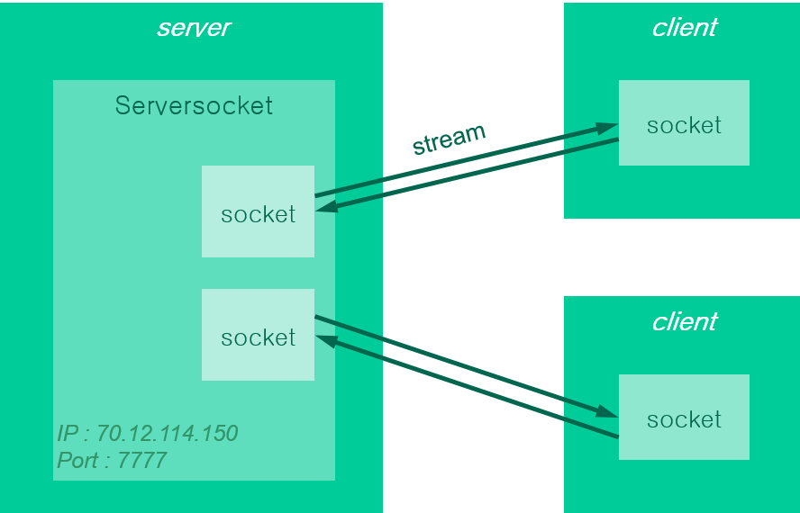

# project_oneclick

## 2022 mini project - socket programming with C [미니 프로젝트]

* [Markdown 문법 사용하기](http://whatismarkdown.com/)

* [git add Permision denied 관련 해결](https://openingsound.tistory.com/95)

* [telent 사용하기](https://opentutorials.org/module/2160/12506) - cmd 실행 후 telnet localhost port번호 입력 (ex) telnet localhost 9090)

# 1. 프로젝트 개요
## 1.1 TCP/IP 프로토콜 기반 소켓 통신 구현하기 with C
[TCP/IP 통신이란?](https://www.ibm.com/docs/ko/aix/7.1?topic=management-transmission-control-protocolinternet-protocol) 컴퓨터가 서로 통신하는 경우, 특정 규칙이나 프로토콜을 사용하여 순서대로 데이터를 전송 및 수신할 수 있다. 전 세계를 통해 가장 일상적으로 사용되는 프로토콜 세트 중 하나가 TCP/IP(Transmission Control Protocol/Internet Protocol)이다. TCP/IP는 네트워크에 연결된 여러 Host 사이의 통신을 허용한다. 하드웨어에 구애받지 않고, 여러 컴퓨터들을 제어할 수 있다는 점에서 TCP/IP 및 소켓 통신 기반의 간단한 메신저를 만들어보고자 한다. 

## 1.2. Socket 통신 사용하기
[소켓 통신이란?](https://kotlinworld.com/75) 소켓(Socket)은 프로세스가 드넓은 네트워크 세계로 데이터를 내보내거나 혹은 그 세계로부터 데이터를 받기 위한 실제적인 청구 역할을 한다. 그러므로 프로세스가 데이터를 보내거나 받기 위해서는 반드시 소켓을 열어서 소켓에 데이터를 써보내거나 소켓으로부터 데이터를 읽어들여야 한다. 소켓은 <u>프로토콜, IP, 포트</u>로 정의된다.

### 1.2.1 용어정리
* <b>프로토콜</b> - 어떤 시스템이 다른 시스템과 통신을 원활하게 수행하도록 해주는 통신 규약

* <b>IP</b> - 전 세계 컴퓨터에 부여된 고유의 식별 주소

* <b>포트</b> - 네트워크 상에서 통신하기 위해서 호스트 내부적으로 프로세스가 할당받아야 하는 고유한 숫자. 한 호스트 내에서 네트워크 통신을 하고 있는 프로세스를 식별하기 위해 사용되는 값으로, 같은 호스트 내에서 서로 다른 프로세스가 같은 포트 넘버를 가질 수 없다. 같은 컴퓨터 내에서 프로그램을 식별하는 번호

### 1.2.2 소켓 통신 흐름

> * <b>SERVER</b> : 클라이언트에서 접속할 때 까지 Listen 상태로 대기한다. 클라이언트의 연결 요청이 오면 accept를 통해 접속을 허락한다. Server socket을 생성할 때, 사용할 프로토콜, IP, 포트 번호를 지정해 준다.  
> * <b>CLIENT</b> : 서버와 같은 프로토콜, 서버의 IP 및 포트 번호를 사용해 Socket을 생성하고 서버와 통신할 수 있다.

### 1.2.3 정리
소켓은 기본적으로 Connection 기반의 양방향 통신이다. 서버와 클라이언트 모두 Socket이 필요하며, 해당 Socket이 연결되어 있는 상태에서 통신이 가능하다. 따라서 서버가 클라이언트로 메시지를 보내고 받을 수 있지만, 클라이언트 역시 서버로 메시지를 보내고 받을 수 있다. 이 Connection이 계속해서 유지되기 때문에 스트리밍이나 실시간 채팅 등 실시간 데이터 교환에서 이점이 있다. 하지만 계속해서 Connection을 유지해야 하는 부분에서 많은 리소스가 소모된다는 단점이 있다.  

# 2. 프로젝트 구현
## 2.1 SERVER-CLIENT : Basic Socket Communication
 

* <em>socket()</em> - 서버에서 사용 할 소켓을 생성하는 함수
* <em>bind()</em> - 생성한 소켓에 사용할 프로토콜, IP, 포트 넘버를 부여하고 BIND하는 함수
* <em>listen()</em> - 서버에서 클라이언트의 요청이 오는지 확인하는 함수
* <em>accpet()</em> - 클라이언트에서 connect 연결 요청이 왔을 때, 해당 연결을 허용하는 함수
* <em>recv()/send()</em> - 서버 및 클라이언트 소켓에서 데이터를 송/수신하는 함수